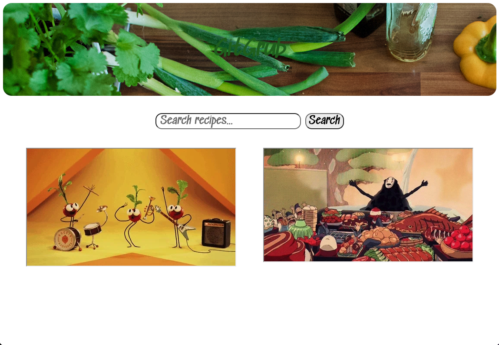
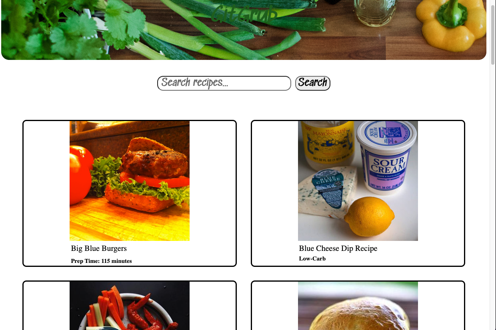
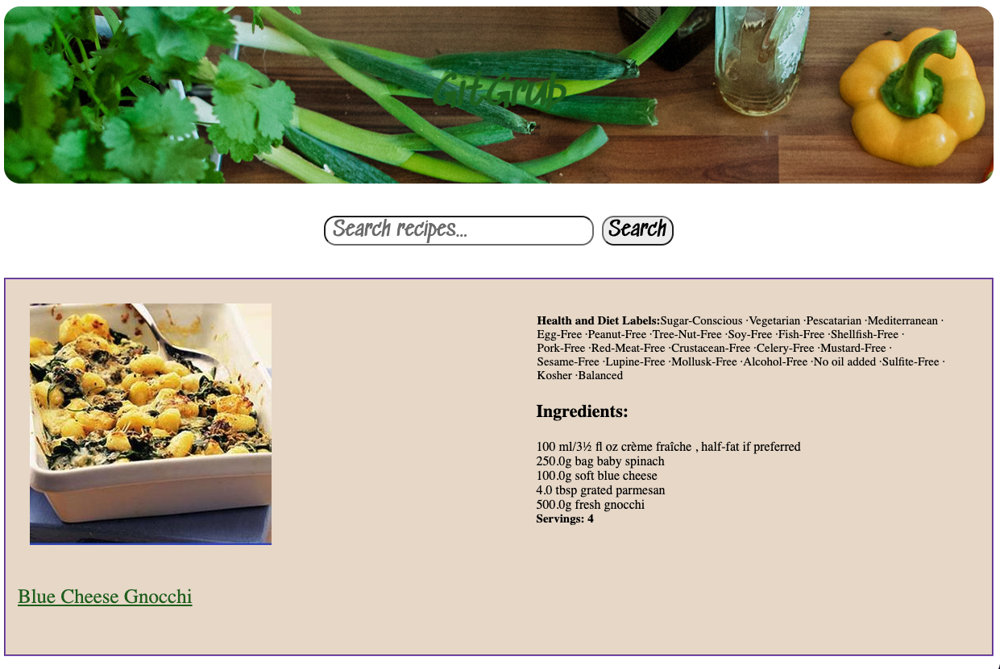

# GitGrub
## Derek Sumpmann, January 2022
====================================================
## Description

An app for all people who are tired of sorting through the insane amount of food blogs and what not in order to just decide on a recipe. A user can search for an ingredient, a diet (ie. vegan, high-protein), almost whatever and get a list of recipes back. Great for greasing the wheels on some culinary inspiration. 

### Technologies Used
1. CSS
2. JavaScript
3. React
4. Netlify

## Getting Started

Let's take a [look](https://vigilant-panini-22dc02.netlify.app)!
------------------------------------------  

## Contribution Guidelines
- If you would like to contribute to this project, fork & clone [this](https://github.com/dsump/GitGrub) directory. All necessary code files are in src/Components. If you have suggestions, feel free to file an issue on GitHub and we can review together. In that case, start a pull request and I'll take a look at any bugs you fix or ideas for expansion you may have. 